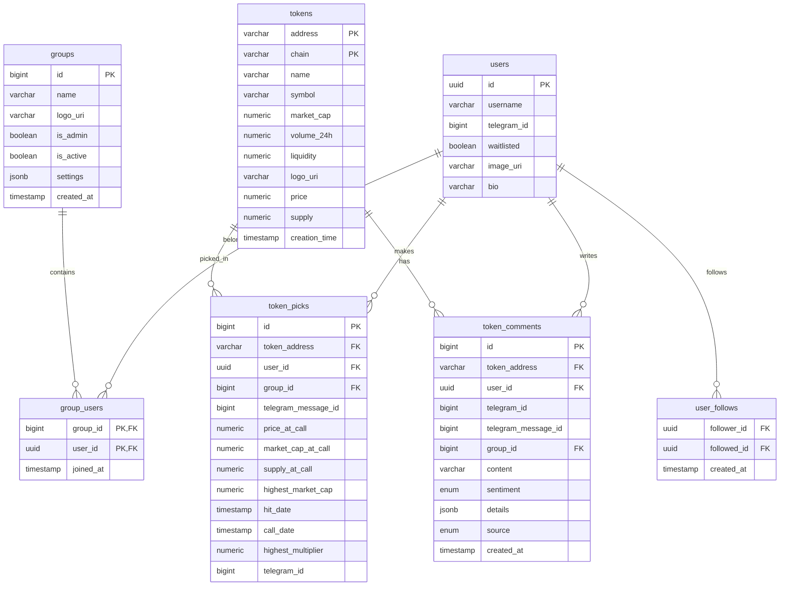
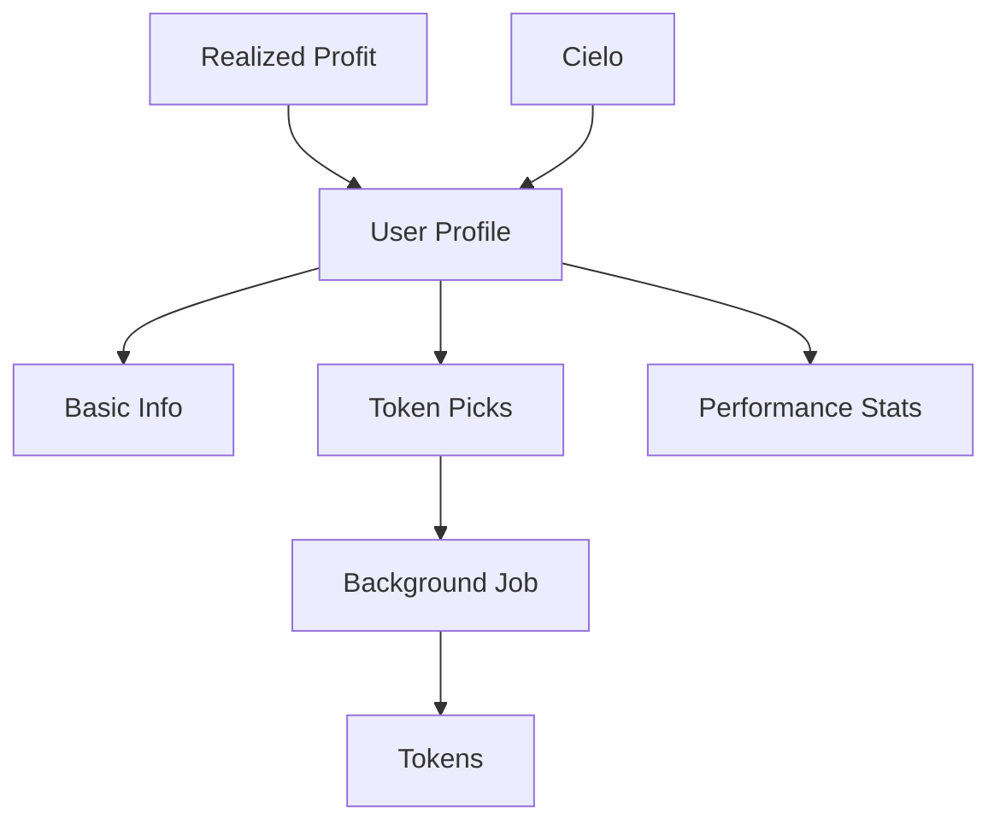

# Social Service - Architecture and Data Flow

## 1. System Overview

- Rust-based social network service for cryptocurrency trading
- Handles user profiles, token picks, groups, and performance stats
- Integrates with external services (Birdeye, Cielo, Telegram)
- Endpoints:
  - Staging: https://staging-social.bullpen.fi/docs
  - Production: https://social.bullpen.fi/docs

## 2. Data  Flow
### 2.1 Overview

### 2.2 How the data is stored

#### Token Picks
- Created through:
  - Telegram bot commands
  - API endpoints
- Deleted through:
  - Telegram Cancel Pick Button
  - API endpoints
- Tables:
  - token_picks
  - tokens
- Triggers:
  - social.token_picks_notify_trigger

#### Groups
- Created via Telegram
- Stores:
  - Group metadata
  - Member relationships
  - Privacy settings
- Tables:
  - groups
  - group_users

### 2.3 How the data is processed

#### Token Pick Processing Job
- Runs every 10 minutes
- Updates token metrics and performance
- Key features:
  - Batch processing (50 picks) * (4 threads) = 200 picks at a time
  - Redis-based locking
  - Parallel execution

#### Data Aggregation
- Updates:
  - Market caps
  - Price multipliers
  - Performance metrics
- Caches results in Redis
- Reference:

### 2.4 How the data is retrieved
#### User Data
- User registration through Telegram integration
- Profile creation with:
  - Basic info (username, bio)
  - Avatar images (S3 storage)
  - Wallet connections
  - 
#### Profile Data

- Cached responses
- Aggregated statistics
- Integration with:
  - Cielo (PnL data)
  - UserGate (trading stats)

#### Leaderboards
- Multiple timeframes:
  - 6 hours
  - 24 hours
  - Week
  - Month
  - All-time
- Sorted by:
  - Returns
  - Hit rate
  - Total picks

## 3. External Integrations

### Price Data
- Birdeye API
- Data Aggregator Service
- Token metadata service

### Performance Tracking
- Cielo Finance API
- UserGate Service
- Reference:

## 4. Caching Strategy

- Redis for high-performance data access
- Cached entities:
  - User profiles
  - Token prices
  - Leaderboards
  - Group statistics
- TTL-based invalidation
- Pipeline operations for efficiency

## 5. Database Schema

### Key Tables
- Users
- Token Picks
- Groups
- User Follows
  
### Notifications
- Trigger-based system
- Real-time updates via change data capture (CDC)

## 6. Events and Data Dependencies
### Profile Data Flow

- User profile data is composed of multiple data sources:
  - Basic profile info (username, avatar)
  - Token pick statistics (38 total picks, 23.68% hit rate)
  - Trading performance (1.91x avg. pick return)
  - Realized profit from Cielo ($3.98)

### 6.1 Event System
1. User Data Events
   - Triggered when profile information is updated
   - Updates cached profile data
   - Refreshes UI components

2. Token Pick Events
   - Two main event types:
     - Token Pick Saved (when user makes a new pick)
     - Token Pick Updated (via background job)
   - Updates token statistics and performance metrics

### Data Integration Flow

